# Практика: Создаем Cloud-native приложение для экспериментов
1. Создаем само приложение
2. Создаем юнит тесты для приложения
3. Докеризируем: Создаем докерфайл для сборки контейнера
4. Описываем CI-сценарии для Github Actions производящие lint, unit-test, build-test
5. Куберизируем: Создаем манифесты для запуска приложения и сервисов в кластере
6. Описываем CD-сценарии для Github Actions производящие docker build и push в Docker Hub
7. Устанавливаем ArgoCD и подключаем к GitHub
8. Проверяем весь CI/CD workflow в сборе

Создаем репозиторий для приложения, клонируем репо с гитхаба

структура каталогов
```
├── server
│   ├── application.py
│   ├── dockerfile
│   └── test_application.py
└── requiremnts.txt
```
requirements.txt
```
pylint
pytest
```
application.py
```
import http.server
import socketserver

PORT = 8000

class TestMe():
    def take_five(self):
        return 4

    def port(self):
        return PORT

if __name__=='__main__':
    Handler = http.server.SimpleHTTPRequestHandler

    with socketserver.TCPServer(("",PORT),Handler) as http:
        print("servingatport", PORT)
        http.serve_forever()
```
dockerfile
```
FROM python:3.7-slim
RUN mkdir -p /usr/local/http-server
RUN useradd runner -d /home/runner-m-s/bin/bash
WORKDIR /usr/local/http-server
ADD ./application.py /usr/local/http-server/application.py
RUN chown -R runner:runner /usr/local/http-server/
EXPOSE 8000
USER runner
CMD ["python3","-u","/usr/local/http-server/application.py"]
```
test_application.py
```
import pytest
from application import TestMe

def test_server():
    assert TestMe().take_five() == 5

def test_port():
    assert TestMe().port() == 8000
```
Проверяем, что всё пушится в гитхаб

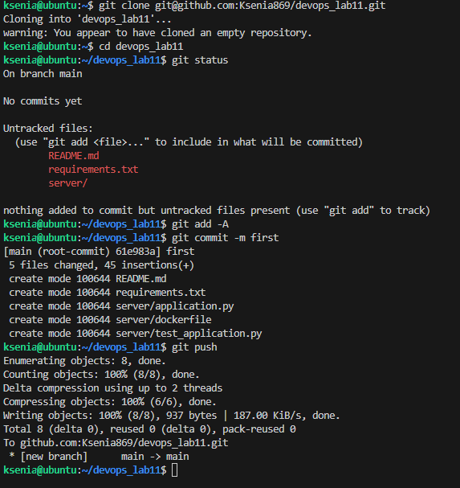

Переводим разработку в отдельную ветку dev


Защищаем ветку main от прямых изменений,
теперь только merge-requests

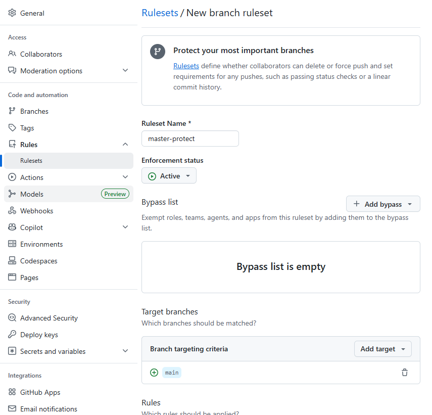

Добавляем CI-пайплайны (сценарии)– Github Actions

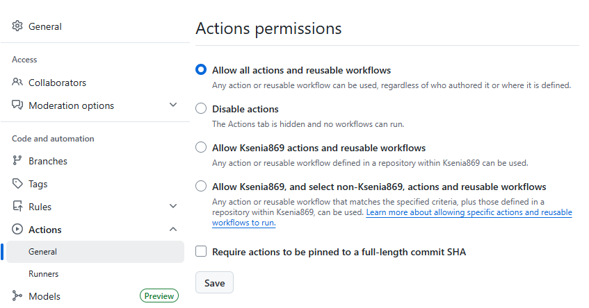
```
├── server
│   ├── application.py
│   ├── dockerfile
│   └── test_application.py
├── requiremnts.txt
├── .github
│    └── workflows
│        ├── cicd.yml
│        └── devops_course_pipeline.yml
```
Тестовыйсценарий

.github/workflows/devops_course_pipeline.yml
```
name: Github Actions DevOps course
on : push
jobs:
  DevOps-Course-first-job:
    runs-on: ubuntu-latest
    steps:
      - run: echo "I run my first Github Actions"
      - name: Show uptime
        run: uptime
      - name: Where am I?
        run: pwd
      - name: Who am I?
        run: whoami
```
Добавляю сценарии CI в гит

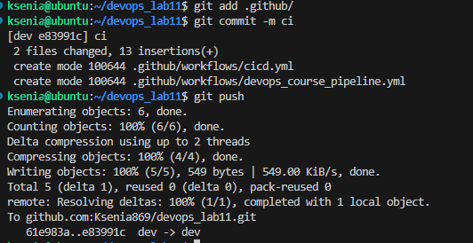
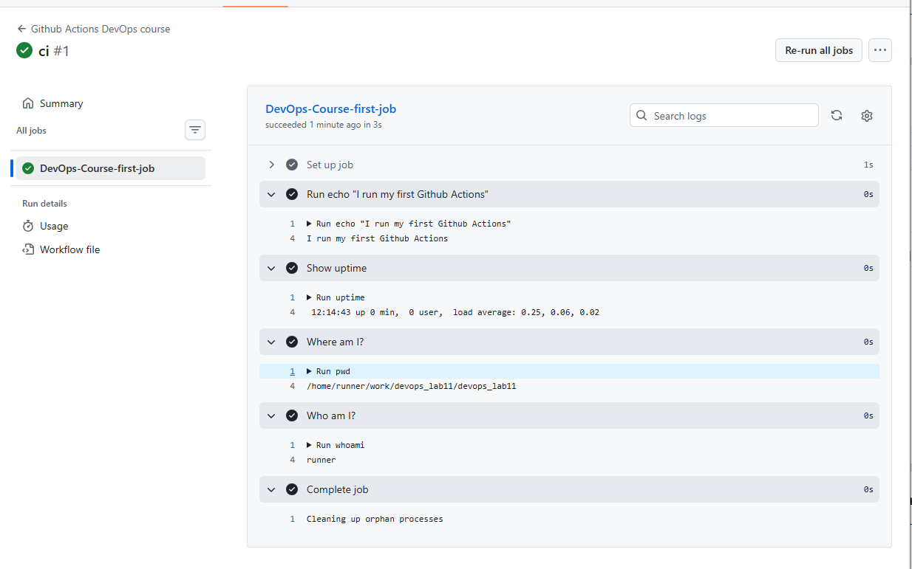

Боевой сценарий

.github/workflows/cicd.yml
```
name: LINT-TEST-BUILD-CHECK
on:
  push:
    branches: [ dev ]

jobs:

  lint:
    runs-on: ubuntu-24.04
    steps:
    - uses: actions/checkout@v4
    - uses: actions/setup-python@v5
      with:
        python-version: '3.10'
    - run: pip install -r requirements.txt; pylint server/application.py

  unit-tests:
    runs-on: ubuntu-24.04
    steps:
    - uses: actions/checkout@v4
    - uses: actions/setup-python@v5
      with:
        python-version: '3.10'
    - run: pip install -r requirements.txt; pytest --junitxml=junit/test-results.xml

  build-test:
    needs: [ lint, unit-tests ]
    runs-on: ubuntu-24.04
    steps:
    - uses: actions/checkout@v4
    - run: docker build -t test-image ./server --file ./server/dockerfile
    - run: docker run -d --name app-server8000 -p 8000:8000 --restart unless-stopped test-image
    - run: sleep 11
    - run: docker ps -a
    - run: sleep 11
    - run: 'curl 127.0.0.1:8000'
```
Добавляем новый сценарий в гит


получаю ошибки

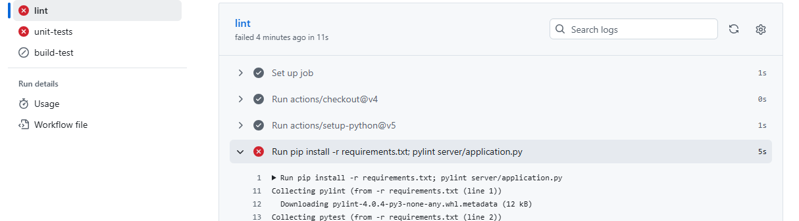
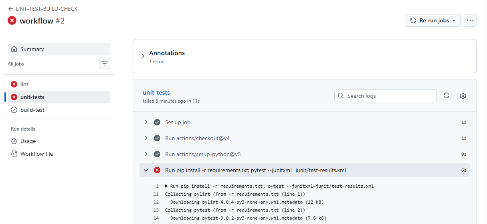

исправляю ошибку, unit-tests прошёл успешно

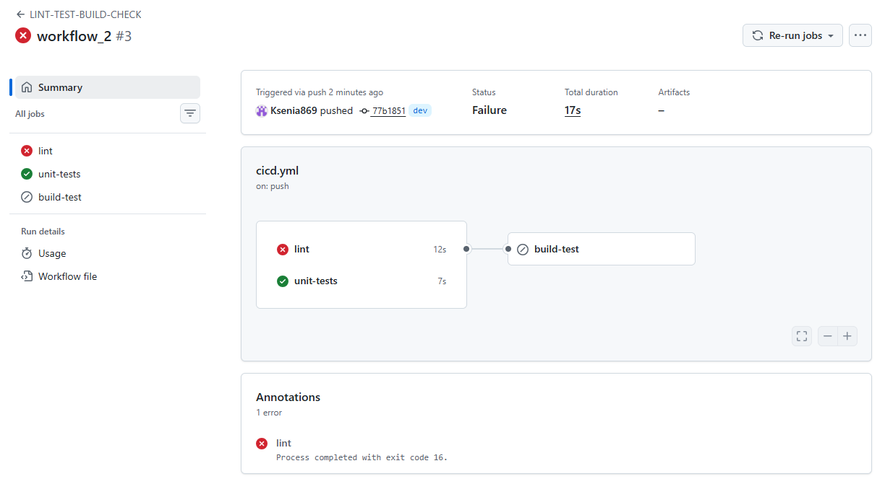

исправляю вторую ошибку, все успешно

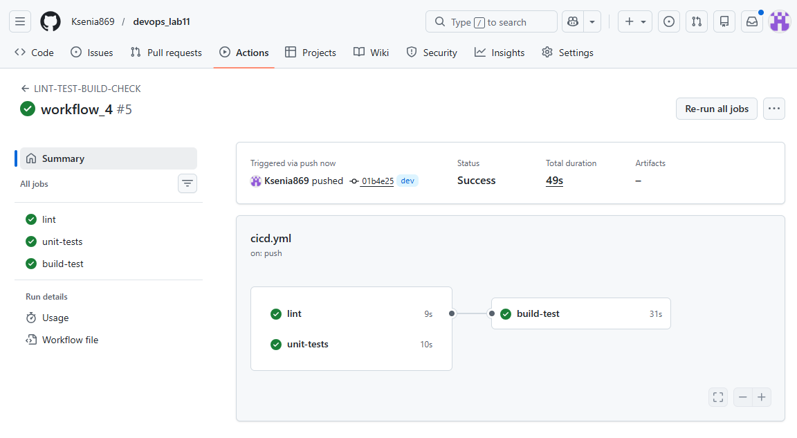

Создаю k8s манифест server-k8s-manifests/devops-psu.yml
```
apiVersion: apps/v1
kind: Deployment
metadata:
  name: devops-psu
  labels:
    app: devops-psu
    release-date: RELEASE-DATE
  namespace: devops-psu
spec:
  replicas: 1
  selector:
    matchLabels:
      app: devops-psu
  template:
    metadata:
      labels:
        app: devops-psu
        svc: frontend
        release-date: RELEASE-DATE
    spec:
      containers:
      - name: devops-psu-server
        image: ksenia869/devops-psu:latest
        imagePullPolicy: Always
        ports:
        - containerPort: 8000
---
apiVersion: v1
kind: Service
metadata:
  name: service-devops
  labels:
    app: devops-psu
  namespace: devops-psu
spec:
  type: LoadBalancer
  selector:
    app: devops-psu
    svc: frontend
  ports:
  - port: 12345
    targetPort: 8000
  externalIPs:
  - 10.0.2.15
```
Удаляю деплойменты прошлой лабораторной работы

Куберизирую приложение, применяю k8s-манифесты

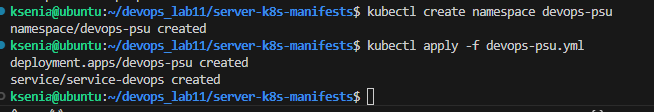

Авторизуюсь в репозитории

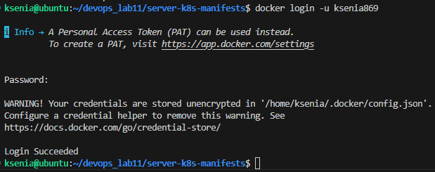

Собираю образ и заливаю его в репозиторий

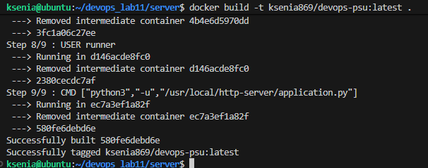

проверяю

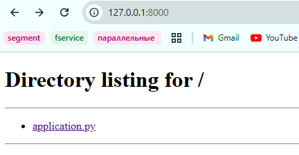

Добавляем публикацию докер-образа приложения в хранилище
Зарегистрироваться в dockerHub и создать паблик-репо для образов

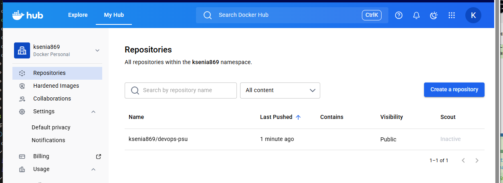
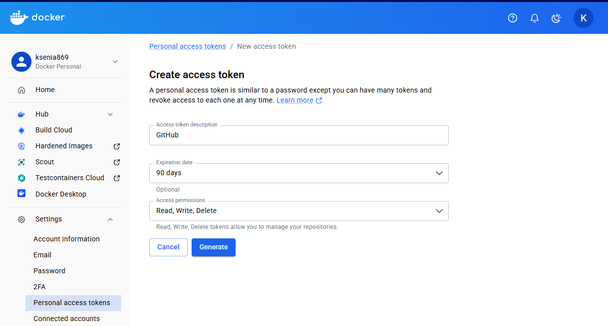

Создаем пайплайн для сборки и публикации образа в Docker Hub
.github/workflows/release.yml
```
name: Publish Docker image
on:
  push:
    branches: [ main ]

permissions:
  contents: write

jobs:
  push_to_registry:
    name: Push Docker image to Docker Hub
    runs-on: ubuntu-24.04
    steps:
      - name: Check out the repo
        uses: actions/checkout@v4

      - name: Log in to Docker Hub
        uses: docker/login-action@v3
        with:
          username: ${{ secrets.DOCKER_USERNAME }}
          password: ${{ secrets.DOCKER_TOKEN }}

      - name: Build and push Docker image
        id: push
        uses: docker/build-push-action@v6
        with:
          context: ./server/
          push: true
          tags: ${{ secrets.DOCKER_USERNAME }}/devops-psu:latest

  touch-k8s-manifest:
    needs: [ push_to_registry ]
    runs-on: ubuntu-24.04
    steps:
      - uses: actions/checkout@v4
      - name: Insert release date
        run: 'sed -i "s/release-date: .*$/release-date: s`date +%s`/g" ./server-k8s-manifests/devops-psu.yml'

      - name: Commit manifest
        run: |
          git config --global user.name 'Release Runner'
          git config --global user.email 'runner@users.noreply.github.com'
          git commit -am "Release"
          git push --force origin main:release
```
Делаем коммит новых файлов в репо, создаем pull-request и выполняем merge в main

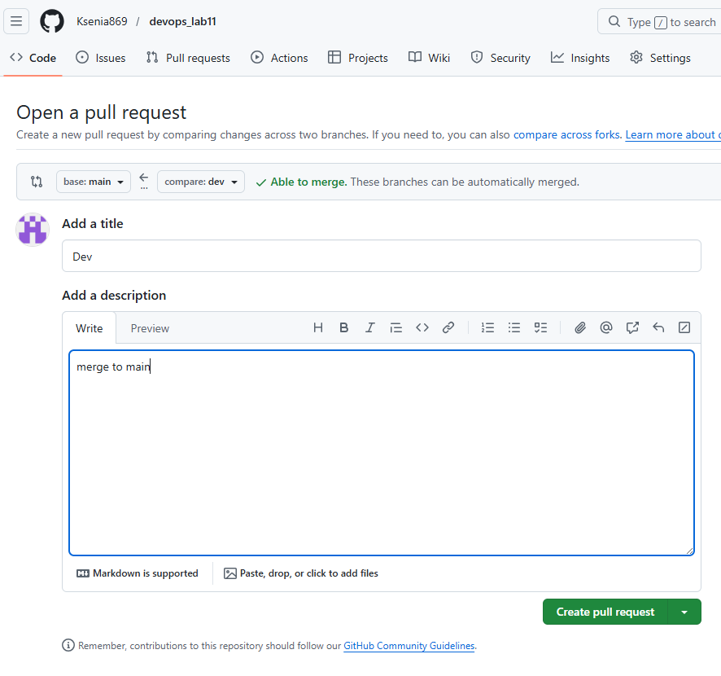

все успешно

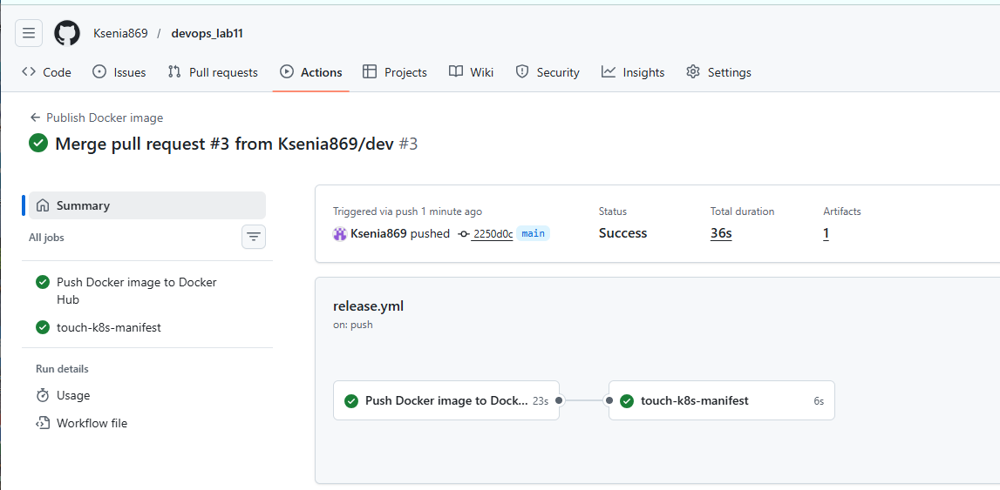
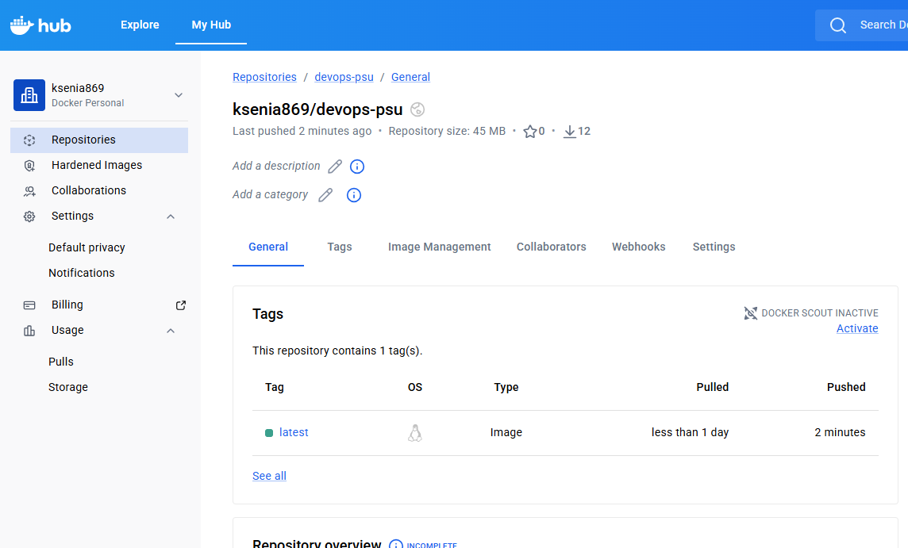

Видим, что пайплайн успешно положил новый образ в докерхаб

Устанавливаем ArgoCD

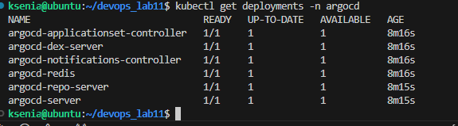

Вытаскиваю стартовый админский пароль
Пробрасываю api-сервис ArgoCD наружу

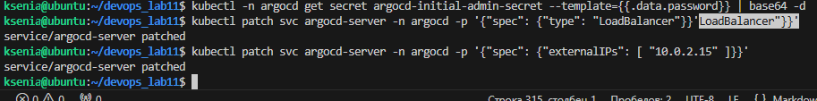
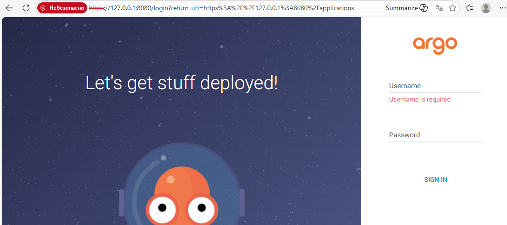

Подключаю к ArgoCDсвой GitHub репо с использованием приватного ключа

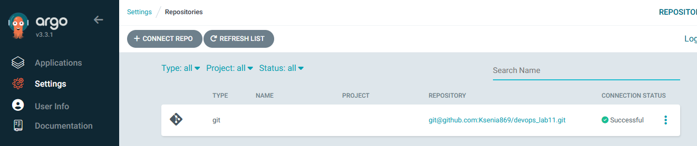

Подключаем манифесты приложения для контроля состояния

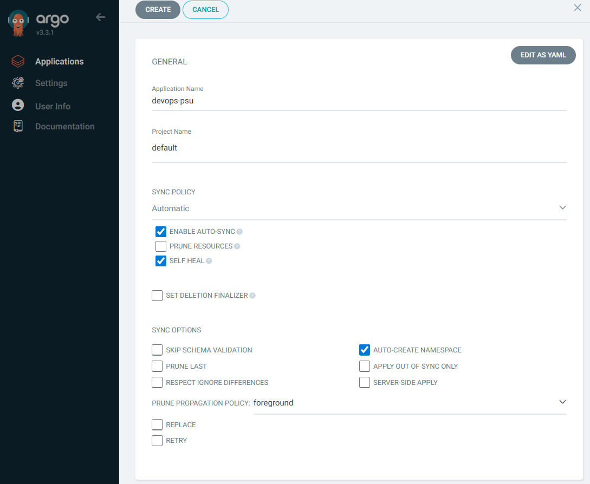

Выбираю репо, указываю ветку для отслеживания и путь к манифестам

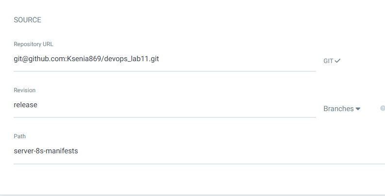

Указываю реквизиты кластера k8s и пространство имен

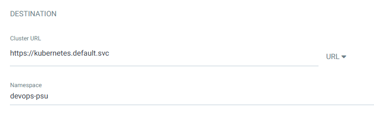

Устанавливаю приложение

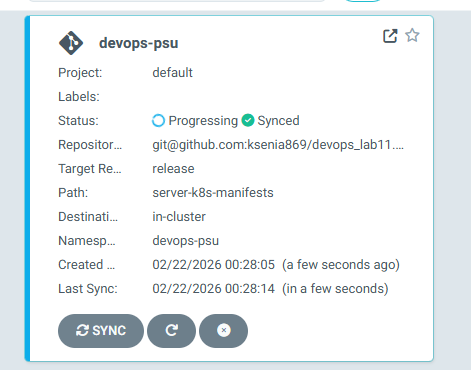
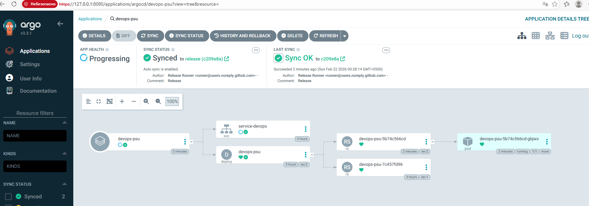

Проверка
1. Изменяем приложение- добавляем индексный файл (echo «Hello, v2» > index.html)- правим докерфайл

dockerfile
```
FROM python:3.7-slim
RUN mkdir -p /usr/local/http-server
RUN useradd runner -d /home/runner-m-s/bin/bash
WORKDIR /usr/local/http-server
ADD ./application.py /usr/local/http-server/application.py
ADD ./index.html /usr/local/http-server/index.html
RUN chown -R runner:runner /usr/local/http-server/
EXPOSE 8000
USER runner
CMD ["python3","-u","/usr/local/http-server/application.py"]
```
Сохраняем изменение в ветке dev

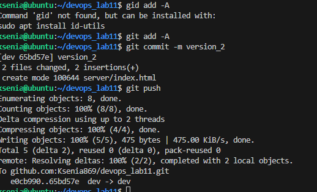

новый образ будет отправлен на DockerHub

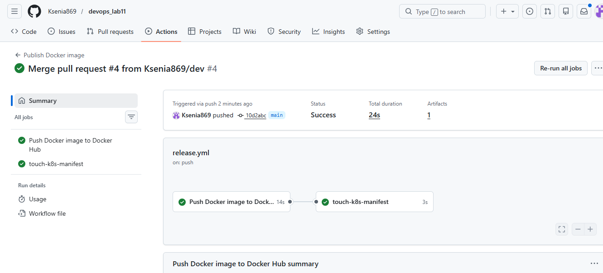

ArgoCD подхватил изменения манифеста и синхронизировал состояние в k8s

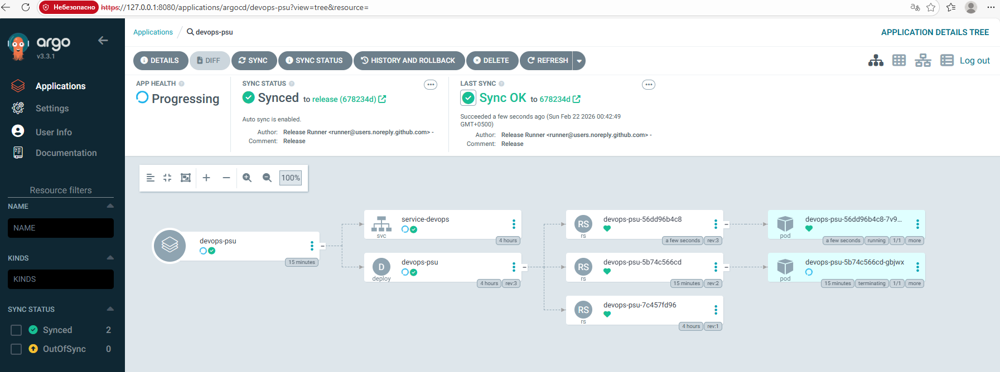